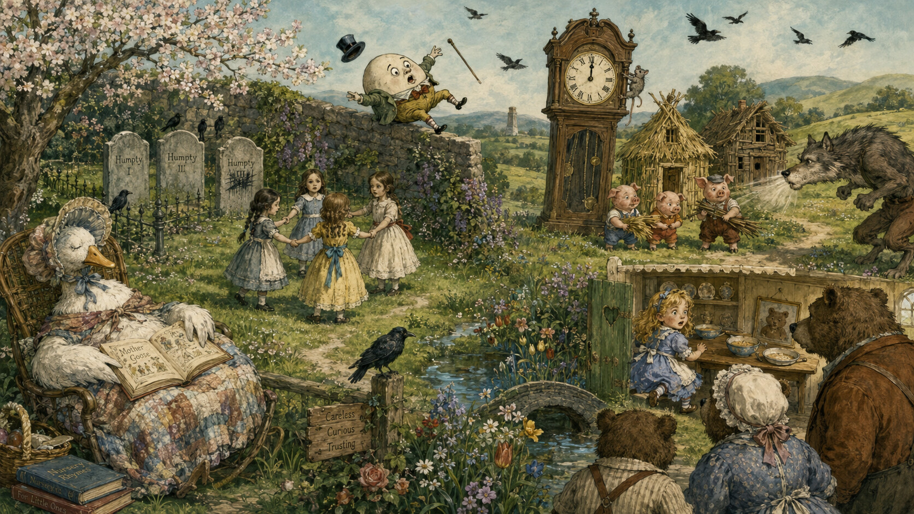
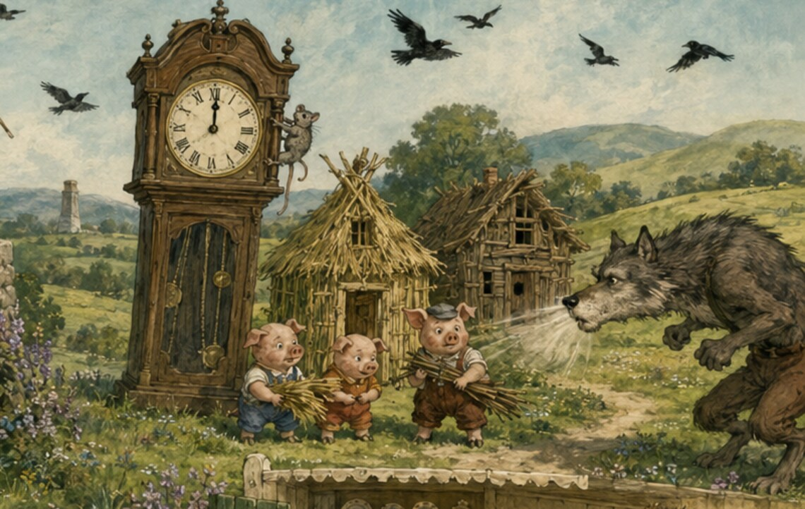
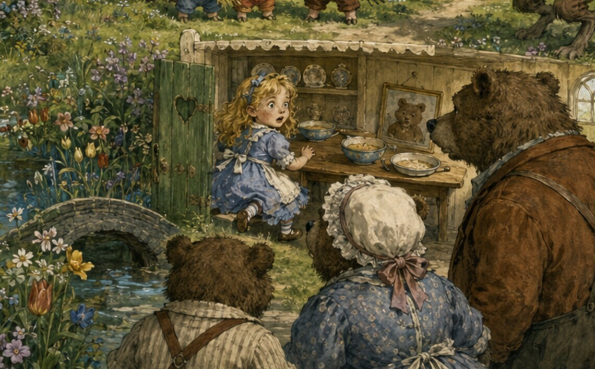

  

# Mother Goose

Old stories for recurring builder problems.

Nursery rhymes and familiar tales survive because each one compresses a lesson into a pattern people remember. Mother Goose applies that same advantage to AI building: a failed repair becomes Humpty Dumpty, escalating resilience becomes the Three Little Pigs, and an over- or under-sized setting becomes Goldilocks.

The stories are memorable. The procedures are exact.

## Router

Mother Goose selects one story whose lesson matches the current problem. It does not run every skill or blend their procedures.

Example:

    $mother-goose route this repair that has failed three times

  

## Skill catalog

| Skill | Story rule | Builder problem | Enforced behavior |
| --- | --- | --- | --- |
| [Mother Goose](skills/mother-goose/) | Choose the tale with the matching lesson | Unclear method | Route to exactly one story-based skill |
| [Ring Around the Rosie](skills/ring-around-the-rosie/) | One falls each round | Weak options and excess code | Eliminate exactly one weakest candidate per round |
| [Humpty Dumpty](skills/humpty-dumpty/) | Stop trying to rebuild the same broken egg | Repeated failed repairs | Preserve requirements and replace the failed strategy |
| [Hickory Dickory Dock](skills/hickory-dickory-dock/) | The clock controls the stop | Unhealthy long sessions | Checkpoint at one hour and require a five-minute break |
| [Three Little Pigs](skills/three-little-pigs/) | Straw, sticks, then bricks | Untested resilience | Test three escalating failure or threat levels |
| [Goldilocks](skills/goldilocks/) | Too much, too little, just right | Bad configuration balance | Calculate the median or justify the bounded middle choice |

  

## Use

Codex uses dollar mentions:

    $three-little-pigs test this upload pipeline at straw, sticks, and bricks levels

ChatGPT supports at-mentions when the skill is installed:

    @three-little-pigs test this upload pipeline at straw, sticks, and bricks levels

The skills are explicit-invocation only. A story should not silently change an ordinary task.

## Install

Skills install into the host application, not into GPT, Claude, or DeepSeek model weights.

The no-dependency installer works on Windows, macOS, and Linux.

Install the complete collection for every Codex project:

    python scripts/install.py --host codex --scope user

Install only the router:

    python scripts/install.py --host codex --scope user --skill mother-goose

Install into one Codex project:

    python scripts/install.py --host codex --scope project --project PATH_TO_PROJECT

Install for every Claude Code project:

    python scripts/install.py --host claude-code --scope user

Use a DeepSeek-powered or other Agent Skills-compatible host by naming the folder it scans:

    python scripts/install.py --host custom --destination PATH_TO_SKILLS

Add `--dry-run` to preview the copy. Existing skill folders are protected unless `--force` is explicit. Run `python scripts/install.py --list` to see the names available for selective installation.

Once this repository is public, Codex users can also ask `$skill-installer` to install skills from `https://github.com/jawsublime-byte/mother-goose`.

The included `.codex-plugin/plugin.json` packages the complete collection for ChatGPT Work, the ChatGPT desktop app, and Codex plugin distribution. A local filesystem installer cannot inject a plugin into hosted ChatGPT; use that product's plugin installation flow after publication.

## Boundaries

- Humpty Dumpty changes strategy, not requirements.
- Ring Around the Rosie never removes an option without a stated criterion and evidence.
- Goldilocks distinguishes a mathematical median from a subjective compromise.
- Hickory Dickory Dock does not pretend to monitor time when the host supplies no clock or continuing session.
- Three Little Pigs remains inside authorized, non-destructive test scope.

All skills yield to higher-level safety rules, repository policy, permission limits, and explicit approval gates.

  

## Validate

Run:

    python scripts/validate_repo.py

## Contributing

Read CONTRIBUTING.md before proposing a rhyme or tale. The moral must translate naturally into one repeated builder problem and a testable procedure.

## From the builder

Created by Joe, an online English teacher building practical, local-first tools for safer and more predictable AI-assisted work.

On the workbench:

- **Echoes** — local-first archive archaeology, project reconstruction, and timeline recovery.
- **The MCP Workshop Manual** — a field-repair reference for diagnosing and repairing MCP infrastructure.

Projects will be linked here only when they are ready for public testing or release.

## License

MIT. See LICENSE.

See [NOTICE.md](NOTICE.md) for the independent-project and third-party mark notice.
